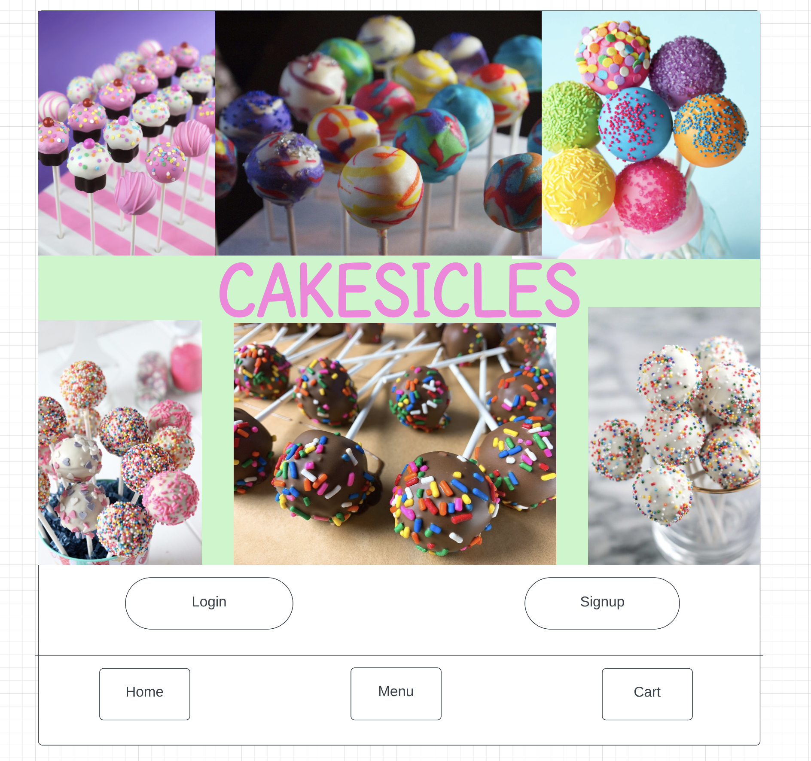
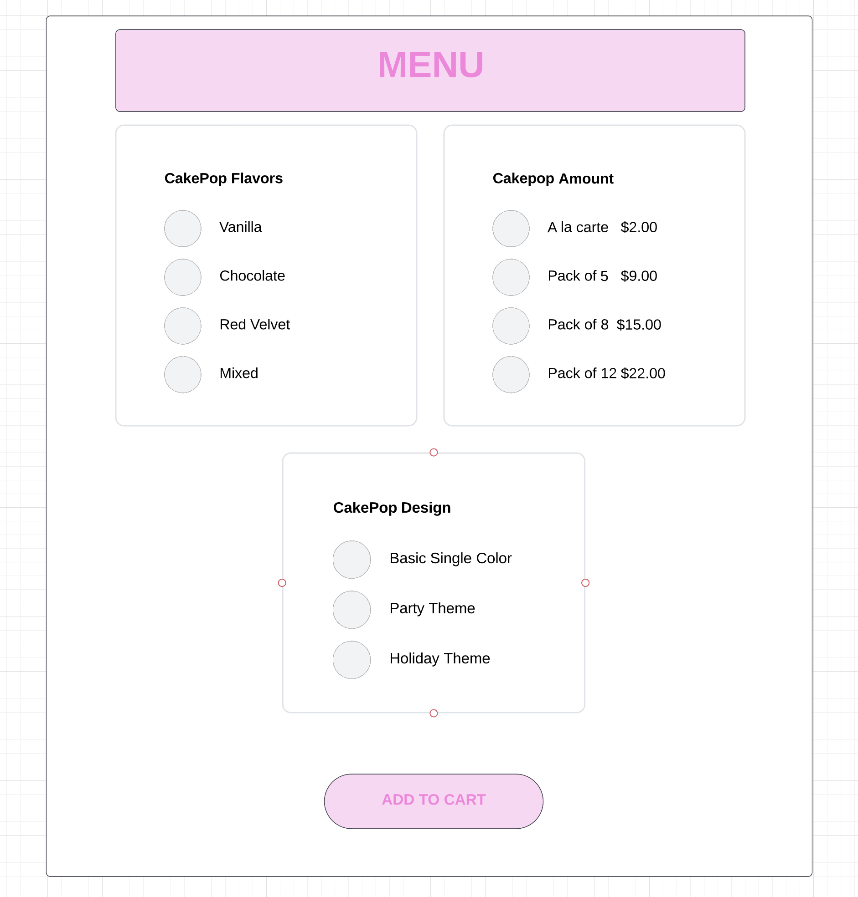
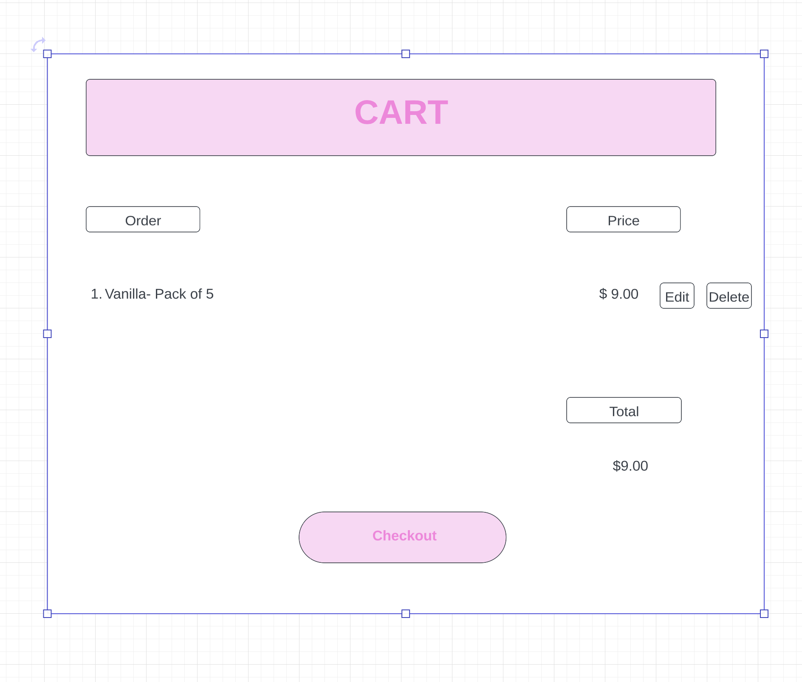

# CakePop_App
# CakePop App

<!--Table of Contents-->
Table of Contents
<ol>
  <li>
    <a href= "#CakePop_App">CakePop App</a>
    <ul>
      <li><a href="#Built-with"> Built With</a></li>
    </ul>
    </li>
    <li>
      <a href="#approach-taken">Approach Taken</a>

  <li><a href="#installation-instructions">Installation Instructions</a></li>
<li><a href="#wire-frames">Wire Frames</a></li>       

</ol>

<!--About the Project-->
# CakePop App

This CakePop App was created to make it simple and fun for customers to order CakePops. This app allows customers to choose CakePop flavors, colors and even a theme for an event. 

### Built With
This is a full stack app that was built using Javascript, CSS, HTML and full CRUD data operations. I used Trello to organize my ideas and keep track of the steps I had to complete.

(<a href="#top">back to top</a>)

### Approach Taken
I began by setting up all my different folders. I set up my controllers folder with two different files, one to show the the user's ability to order cakepops and another that gives me(admin)  the ability to create a login and signup. I set up different models with different schemas for cakepops, orders and users. With this app, users are able to order different cakepops and are able to delete or edit their order. As an admin, I am able to update and delete items on the menu.

### Installation 
Open application in browser or download the application and place your cakepop orders.

(<a href="#top">back to top</a>)

### Wireframes

(<a href="#top">back to top</a>)
